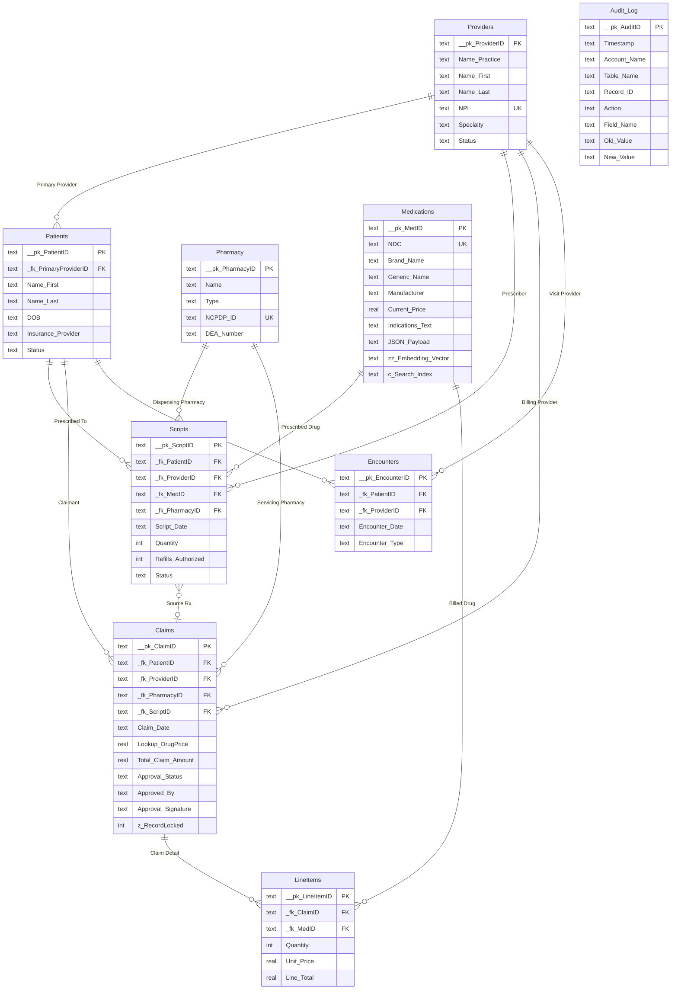

# The Lancaster Hub — Entity Relationship Diagram
## Anchor-Buoy Relational Model

> This ERD mirrors the FileMaker Pro Relationship Graph using the **Anchor-Buoy** methodology for strict context control. Each "Anchor" table is a core entity; "Buoy" tables (joins) connect them without creating ambiguous paths.

## FileMaker Relationship Graph Notes

| Concept | FileMaker Implementation | This Schema |
|---------|------------------------|-------------|
| **Primary Keys** | `Get(UUID)` auto-enter | `__pk_*` fields (UUID v4) |
| **Foreign Keys** | Related field match | `_fk_*` fields with constraints |
| **Anchor Tables** | Left side of graph | `Providers`, `Patients`, `Pharmacy`, `Medications` |
| **Buoy Tables** | Context-specific TOs | `Encounters`, `LineItems` |
| **Lookup** | Auto-enter Lookup | `Lookup_DrugPrice` — frozen at claim creation |
| **Calculated Field** | Stored Calculation | `c_Search_Index` — concatenated, indexed |
| **Container** | Container field | `zz_Embedding_Vector` — vector storage |
